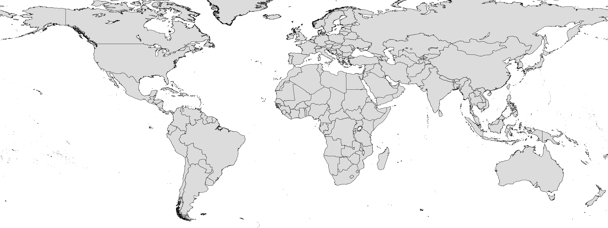
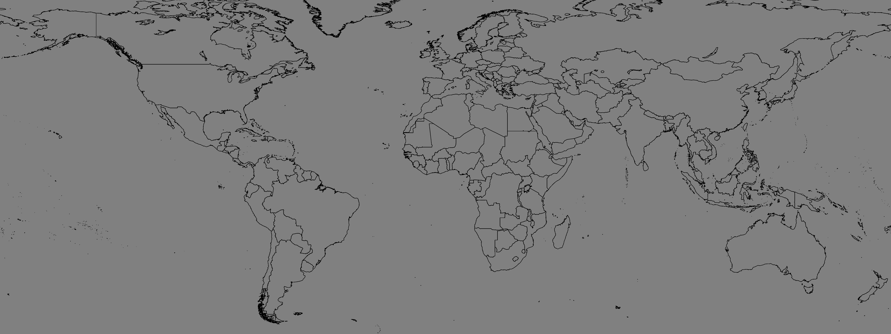
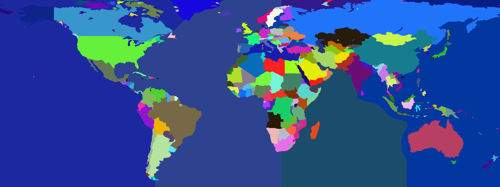
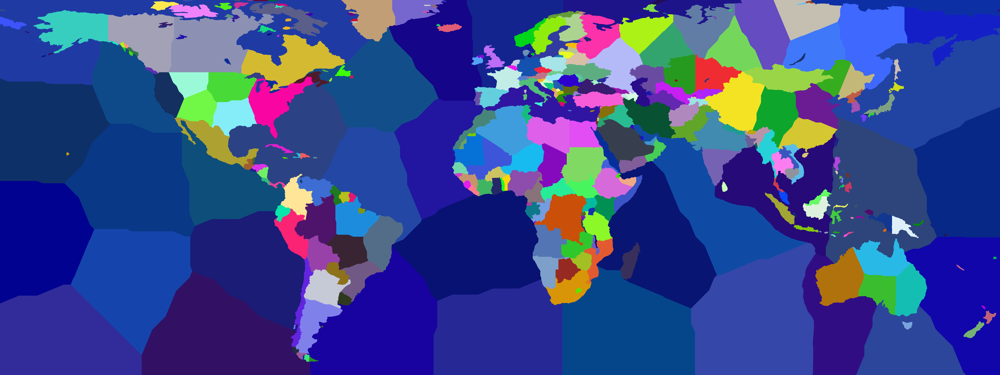
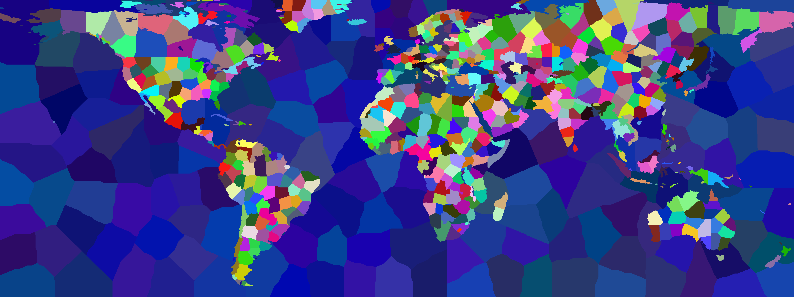
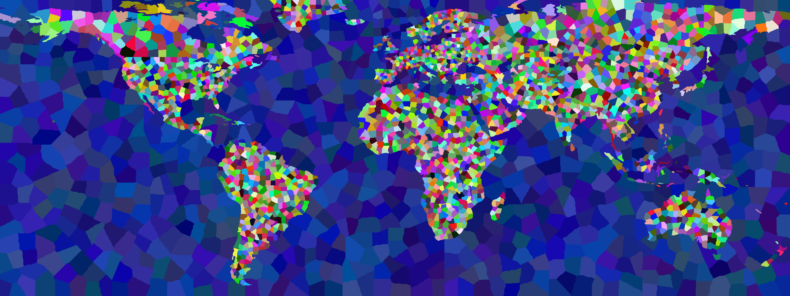

# Open Grand Strategy - Map Tool 
The OpenGS Map Tool is a specialized utility designed to streamline the creation of map data for use in grand strategy games. 
Province and territory maps form the backbone of these games, defining the geographical regions that players interact with.

## Features
- Generate and Export province maps
- Generate and Export province data
- Generate and Export territory maps
- Generate and Export territory data

## Showcase


## How to install
### Option 1 (Windows only):
1. "Releases" section in Github
2. Download and unpack "ogs_maptool.zip"
3. Run the Executable

### Option 2:
1. Clone the repository
2. Install the package on your device (Python 3.12+ required) by running:
	```sh
	pip install .
	```
3. Start project by running "python main.py"

## Terms Definition

- **Area**: A country or a separate island. The largest continuous region, not split by boundaries. Each area can contain multiple density samples.
- **Density Sample**: A subdivision of an area, where density is averaged. Used to control the number of regions in different parts of the map. Children of areas.
- **Territory**: A subdivision of a density sample. Larger than a province, used for regional division(Example with default parameters: Germany has 4 Territories, Austria has 1, the US has dozens).
- **Province**: A subdivision of a territory. The smallest region, used for fine-grained control.

## Performance Tips

- Splitting complex or weird-shaped areas (especially large oceans) into smaller regions improves performance and accuracy.
- Use density/border image to control region sizes: higher density = more, smaller regions; lower density = fewer, larger regions.

## How to Create Classification and Boundary/Density Images

1. **Boundary Image**: Should have pure black lines (RGB 0,0,0) for boundaries. The greyscale of all other values can be used to encode density multipliers (0 = 4x fewer regions, 255 = 4x more regions). <br> Hint: Avoid creating islands or regions that are only borders (i.e., surrounded entirely by black pixels), as these may not be processed correctly.
2. **Classification Image**: Should use RGB (5, 20, 18) for ocean, (150, 68, 192) for land and (0, 255, 0) for lakes.
3. Always use the same resolution for boundary/density and classification images to avoid errors and misalignment.

## GUI Usage

Read the instructions in all tabs and this README.

## Python Usage

#### Cleaning and Creating a Density Image

First import and normalize your source boundary image. Example:


Python example for this conversion:

```python
from opengs_maptool import StepMapTool
from PIL import Image

# Load a raw boundary image
raw_boundary = Image.open("opengs_maptool/examples/input/bound2_orig.png")

# Clean the boundary image (full black borders and normalized density)
cleaned_boundary = StepMapTool.clean_boundary_image(raw_boundary)

# Save the cleaned boundary image for use in later steps
cleaned_boundary.save("opengs_maptool/examples/input/x_bound2_norm.png")
```
Result:


Next edit your boundary image:
1. Edit the image in an image editor (e.g., Paint.NET, Photoshop, GIMP)
2. Change the greyscale values for different territory and province density (1-255)
3. Greyscale value 1 results in 4x fewer provinces and Greyscale value 255 results in 4x more provinces
Important: Greyscale value 0 (black) is reserved for boundaries and will be removed
4. Save your result (`bound2_edited.png` here)


### Stepwise Example (StepMapTool)

```python
def main():
    from opengs_maptool import StepMapTool, export_to_json, export_to_csv
    from PIL import Image
    import numpy as np
    from pathlib import Path

    input_dir = Path("opengs_maptool/examples/input")
    output_dir = Path("opengs_maptool/examples/output")
    output_dir.mkdir(parents=True, exist_ok=True)

	# Import boundary image from before
    boundary_image = Image.open(input_dir / "bound2_edited.png")

	# EITHER Import and Clean uncleaned classification
    raw_class_image = Image.open(input_dir / "class2_orig.png")
    class_image = StepMapTool.clean_class_image(raw_class_image)
	# Export for later if you want:
	#class_image.save(input_dir / "class2_clean.png")

	# OR import already cleaned image (don't if you are unsure)
	#class_image = Image.open(input_dir / "class2_clean.png")

    # **Important**: StepMapTool works with numpy arrays directly to save conversion memory
    # Convert the input images to numpy arrays and ensure the RGBA format
    class_image = np.array(class_image.convert("RGBA"))
    boundary_image = np.array(boundary_image.convert("RGBA"))

    # Step 1: Generate continuous areas
    cont_area_image, cont_area_data = StepMapTool.generate_cont_areas(class_image, boundary_image)
    Image.fromarray(cont_area_image).save(output_dir / "cont_area_image.png")
    export_to_json(cont_area_data, output_dir / "cont_area_data.json")
    export_to_csv(cont_area_data, output_dir / "cont_area_data.csv")

    # Step 2: Generate density samples
    dens_samp_image, dens_samp_data = StepMapTool.generate_dens_samps(
        boundary_image,
        cont_area_image,
        cont_area_data,
        pixels_per_land_dens_samp=30_000, 
        pixels_per_water_dens_samp=175_000,
        #rng_seed=MY_SEED1, # Optionally use a different seed for different results
    )
    Image.fromarray(dens_samp_image).save(output_dir / "dens_samp_image.png")
    export_to_json(dens_samp_data, output_dir / "dens_samp_data.json")
    export_to_csv(dens_samp_data, output_dir / "dens_samp_data.csv")

    # 1. Adapt the pixels_per above and below paramters to your liking.
    #    I recommend having e.g. Pixels per Territory(First Subdivision) set e.g. 5 times larger than Pixels per Province(Second Subdivision).
    # 2. Change the seeds of each step for different results.

    # Step 3: Generate territories
    territory_image, territory_data = StepMapTool.generate_territories(
        boundary_image,
        dens_samp_image,
        dens_samp_data,
        pixels_per_land_territory=6_000, 
        pixels_per_water_territory=35_000,
        #rng_seed=MY_SEED2,
    )
    Image.fromarray(territory_image).save(output_dir / "territory_image.png")
    export_to_json(territory_data, output_dir / "territory_data.json")
    export_to_csv(territory_data, output_dir / "territory_data.csv")

    # Step 4: Generate provinces
    province_image, province_data = StepMapTool.generate_provinces(
        boundary_image,
        territory_image,
        territory_data,
        pixels_per_land_province=1_200,
        pixels_per_water_province=7_000,
        #rng_seed=MY_SEED3,
    )
    Image.fromarray(province_image).save(output_dir / "province_image.png")
    export_to_json(province_data, output_dir / "province_data.json")
    export_to_csv(province_data, output_dir / "province_data.csv")

# Necessary because opengs_maptool uses multiprocessing for some features
if __name__ == "__main__":
	main()
```
Output:
```
Processing boundaries into areas: 100%|████████████| 333/333 [00:30<00:00, 10.93areas/s]
Border assignment:  34%|█████████▌                  | 17/50 [00:17<00:34,  1.06s/rounds]
Generating density samples from areas: 100%|███████| 333/333 [01:28<00:00,  3.77areas/s]
Generating territories from density samples: 100%|█| 393/393 [01:43<00:00,  3.80density samples/s]
Generating provinces from territories: 100%|█| 837/837 [03:11<00:00,  4.36territories/s]
```

### Full Pipeline Example (ProcessMapTool)

```python
def main():
	from opengs_maptool import ProcessMapTool, StepMapTool, export_to_json, export_to_csv
	from PIL import Image
	from pathlib import Path

	input_dir = Path("opengs_maptool/examples/input")
	output_dir = Path("opengs_maptool/examples/output")

	# Import boundary image from before
	boundary_image = Image.open(input_dir / "bound2_edited.png")

	# EITHER Import and Clean uncleaned classification
	raw_class_image = Image.open(input_dir / "class2_orig.png")
	class_image = StepMapTool.clean_class_image(raw_class_image)
	# Export for later if you want:
	#class_image.save(input_dir / "class2_clean.png")

	# OR import already cleaned image (don't if you are unsure)
	#class_image = Image.open(input_dir / "class2_clean.png")


	# Create the Maptool Instance with input images and run it
	maptool = ProcessMapTool(
		class_image=class_image,
		boundary_image=boundary_image,
		cont_areas_rng_seed=1,
		dens_samps_rng_seed=2,
		territories_rng_seed=3,
		provinces_rng_seed=4,
	)
    # Change the seeds of each step for different results.
	result = maptool.generate()

	# Create the export directory and export the result map images:
	output_dir.mkdir(parents=True, exist_ok=True)
	result.cont_area_image.save(output_dir / "cont_area_image.png")
	result.dens_samp_image.save(output_dir / "dens_samp_image.png") # (Optional)
	result.territory_image.save(output_dir / "territory_image.png")
	result.province_image .save(output_dir / "province_image.png" )

	# Export the result as JSON files
	# export_to_json handles exporting the resulting RegionMetadata dataclasses as JSON
	export_to_json(result.cont_area_data, output_dir / "cont_area_data.json")
	export_to_json(result.dens_samp_data, output_dir / "dens_samp_data.json") # (Optional)
	export_to_json(result.territory_data, output_dir / "territory_data.json")
	export_to_json(result.province_data , output_dir / "province_data.json" )

	# OR / AND as CSV files (slightly different columns from JSON)

	# export_to_csv handles exporting the resulting RegionMetadata dataclasses as CSV
	export_to_csv(result.cont_area_data, output_dir / "cont_area_data.csv")
	export_to_csv(result.dens_samp_data, output_dir / "dens_samp_data.csv") # (Optional)
	export_to_csv(result.territory_data, output_dir / "territory_data.csv")
	export_to_csv(result.province_data , output_dir / "province_data.csv" )

# Necessary because opengs_maptool uses multiprocessing for some features
if __name__ == "__main__":
	main()
```
Output:
```
Processing boundaries into areas: 100%|████████████| 333/333 [00:30<00:00, 10.93areas/s]
Border assignment:  34%|█████████▌                  | 17/50 [00:17<00:34,  1.06s/rounds]
Generating density samples from areas: 100%|███████| 333/333 [01:28<00:00,  3.77areas/s]
Generating territories from density samples: 100%|█| 393/393 [01:43<00:00,  3.80density samples/s]
Generating provinces from territories: 100%|█| 837/837 [03:11<00:00,  4.36territories/s]
```
See [here](#result-data-explained) for an explanation of the result contents.

## Result Examples
### Result Maps
#### Continuous Areas (Countries or Islands)

#### Density Samples (Kind of Zero-th Subdivision)

#### Territories (First Real Subdivision)

#### Provinces (Second Real Subdivision)


### Result Data
#### Continuous Areas (Countries or Islands)
##### Python Dataclass
```python
[
	...
	RegionMetadata(
		region_id="AREA000003",
		region_type="land",
		color="#a2b062",
		pixel_count=82,
		density_multiplier=None,
		parent_id=None,
		local_bbox=None,
		local_center=None,
		local_seed=None,
		global_bbox=(1316, 0, 1352, 4),
		global_center=(1337, 1),
		global_seed=(1337, 1),
	),
	...
]
```
##### JSON
```json
[
  ...
  {
    "region_id": "AREA000003",
    "region_type": "land",
    "color": "#a2b062",
    "pixel_count": 82,
    "density_multiplier": null,
    "parent_id": null,
    "local_bbox": null,
    "local_center": null,
    "local_seed": null,
    "global_bbox": [1316, 0, 1352, 4],
    "global_center": [1337, 1],
    "global_seed": [1337, 1],
  },
  ...
]
```
#### CSV
```csv
region_id,region_type,color,pixel_count,parent_id,local_bbox_min_x,local_bbox_min_y,local_bbox_max_x,local_bbox_max_y,local_center_x,local_center_y,local_seed_x,local_seed_y,global_bbox_min_x,global_bbox_min_y,global_bbox_max_x,global_bbox_max_y,global_center_x,global_center_y,global_seed_x,global_seed_y
AREA000001,ocean,#2820a0,2805785,,,,,,,,,,0,0,2087,2111,766,1204,766,1204
AREA000002,ocean,#0c0e8f,254,,,,,,,,,,1027,0,1088,8,1057,3,1057,3
AREA000003,land,#a2b062,82,,,,,,,,,,1316,0,1352,4,1337,1,1337,1
...
```

#### Density Samples / Territories / Provinces (Very similar, Subdivisions)
##### Python Dataclass (here a density sample)
```python
[
	...
	RegionMetadata(
		region_id="DST000001",
		region_type="ocean",
		color="#1d3a6b",
		pixel_count=254,
		density_multiplier=0.33,
		parent_id="AREA000002",
		local_bbox=(0, 0, 61, 8),
		local_center=(28, 3),
		local_seed=(28, 3),
		global_bbox=(1027, 0, 1088, 8),
		global_center=(1055, 3),
		global_seed=(1055, 3),
	),
	...
]
```
##### JSON (here a territory)
```json
[
  ...
  {
    "region_id": "TRT000001",
    "region_type": "land",
    "color": "#4812f5",
    "pixel_count": 82,
    "density_multiplier": 0.35,
    "parent_id": "DST000002",
    "local_bbox": [0, 0, 36, 4],
    "local_center": [20, 2],
    "local_seed": [20, 2],
    "global_bbox": [1316, 0, 1352, 4],
    "global_center": [1336, 2],
    "global_seed": [1336, 2],
  },
  ...
]
```
#### CSV
```csv
region_id,region_type,color,pixel_count,parent_id,local_bbox_min_x,local_bbox_min_y,local_bbox_max_x,local_bbox_max_y,local_center_x,local_center_y,local_seed_x,local_seed_y,global_bbox_min_x,global_bbox_min_y,global_bbox_max_x,global_bbox_max_y,global_center_x,global_center_y,global_seed_x,global_seed_y
DST000001,ocean,#1d3a6b,254,AREA000002,0,0,61,8,28,3,28,3,1027,0,1088,8,1055,3,1055,3
DST000002,land,#4d7318,82,AREA000003,0,0,36,4,20,2,20,2,1316,0,1352,4,1336,2,1336,2
DST000003,ocean,#2103b1,71855,AREA000009,0,0,1007,174,430,50,430,50,3171,0,4178,174,3601,50,3601,50
...
```
OR
```csv
region_id,region_type,color,pixel_count,parent_id,local_bbox_min_x,local_bbox_min_y,local_bbox_max_x,local_bbox_max_y,local_center_x,local_center_y,local_seed_x,local_seed_y,global_bbox_min_x,global_bbox_min_y,global_bbox_max_x,global_bbox_max_y,global_center_x,global_center_y,global_seed_x,global_seed_y
TRT000001,land,#4812f5,82,DST000002,0,0,36,4,20,2,20,2,1316,0,1352,4,1336,2,1336,2
TRT000002,ocean,#291f95,254,DST000001,0,0,61,8,28,3,28,3,1027,0,1088,8,1055,3,1055,3
TRT000003,ocean,#0a2dab,19418,DST000009,0,0,550,65,312,21,284,21,4569,0,5119,65,4881,21,4853,21
...
```
OR
```csv
region_id,region_type,color,pixel_count,parent_id,local_bbox_min_x,local_bbox_min_y,local_bbox_max_x,local_bbox_max_y,local_center_x,local_center_y,local_seed_x,local_seed_y,global_bbox_min_x,global_bbox_min_y,global_bbox_max_x,global_bbox_max_y,global_center_x,global_center_y,global_seed_x,global_seed_y
PRV000001,land,#825332,82,TRT000001,0,0,36,4,20,2,20,2,1316,0,1352,4,1336,2,1336,2
PRV000002,ocean,#3949a8,254,TRT000002,0,0,61,8,28,3,28,3,1027,0,1088,8,1055,3,1055,3
PRV000003,ocean,#10356e,9134,TRT000009,119,0,243,104,177,41,177,40,3782,0,3906,104,3840,41,3840,40
...
```


### Result Data Explained

#### Area Fields (Continuous Areas)

| Field Name      | Type/Format         | Explanation |
|-----------------|---------------------|-------------|
| region_id       | str                 | Unique identifier for the area (e.g., "AREA000003") |
| region_type     | str                 | Type: "land", "ocean", or "lake" |
| color           | str (hex)           | Area color in hex format (e.g., "#a2b062") |
| pixel_count     | int                 | Number of pixels in the area |
| density_multiplier | None             | Density multiplier, nonexistant for areas |
| parent_id       | None                | Parent region ID, areas never have parents |
| local_bbox      | None                | Not used for areas (always None) |
| local_center    | None                | Not used for areas (always None) |
| local_seed      | None                | Not used for areas (always None) |
| global_bbox     | tuple[int, int, int, int] | Bounding box (min_x, min_y, max_x, max_y) in full image (never None) |
| global_center   | tuple[int, int]     | Center (x, y) in full image (never None) |
| global_seed     | tuple[int, int]     | Seed (x, y) in full image (never None) |

#### Density Sample / Territory / Province Fields

| Field Name      | Type/Format         | Explanation |
|-----------------|---------------------|-------------|
| region_id       | str                 | Unique identifier (e.g., "DST000001", "TRT000001", "PRV000001") |
| region_type     | str                 | Type: "land", "ocean", or "lake" |
| color           | str (hex)           | Region color in hex format |
| pixel_count     | int                 | Number of pixels in the region |
| density_multiplier | float            | Density multiplier for this region |
| parent_id       | str                 | Parent region ID (respectively area, density sample, or territory) |
| local_bbox      | tuple[int, int, int, int] | Bounding box relative to parent (never None) |
| local_center    | tuple[int, int]     | Center (x, y) relative to parent (never None) |
| local_seed      | tuple[int, int]     | Seed (x, y) relative to parent (never None) |
| global_bbox     | tuple[int, int, int, int] | Bounding box in full image (never None) |
| global_center   | tuple[int, int]     | Center (x, y) in full image (never None) |
| global_seed     | tuple[int, int]     | Seed (x, y) in full image (never None) |


**Notes:**
- **Global fields** (e.g., `global_bbox`, `global_center`): Coordinates or bounding boxes in the context of the entire map image.
- **Local fields** (e.g., `local_bbox`, `local_center`): Coordinates or bounding boxes relative to the parent region (area, density sample, or territory).
- When cropping or processing a region, use the global bounding box to crop from the full image. Local bounding boxes are useful for operations within a parent region.
- For areas, all local fields (local_bbox, local_center, local_seed) are always None. For density samples, territories, and provinces, local fields are always present (never None).
- All global fields (global_bbox, global_center, global_seed) are always present (never None) for all region types.
- In CSV files, coordinates and bounding boxes are split into multiple columns (e.g., global_bbox_min_x, global_bbox_min_y, global_bbox_max_x, global_bbox_max_y instead of global_bbox), while in JSON and Python, these are represented as tuples/arrays.
- All bounding boxes are inclusive (min and max pixel are both included). For Python-style slicing, add +1 to the max values.

## Best Practices
- Always split very large or complex regions (like world oceans) for better performance.
- Ensure all input images are the same size.
- Avoid manual post-editing: What if you want to rerun it later with tweaked parameters?

## Contributions
Contributions can come in many forms and all are appreciated:
- Feedback
- Code improvements
- Added functionality

## Discord
Follow and/or support the project on [OpenGS Discord Server](https://discord.gg/6apDaJrY)

## Delivered and maintained by

